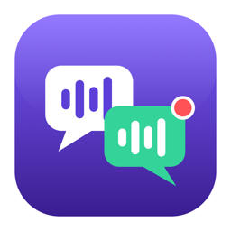
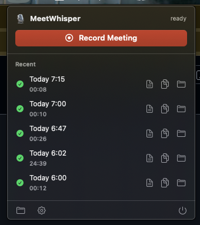
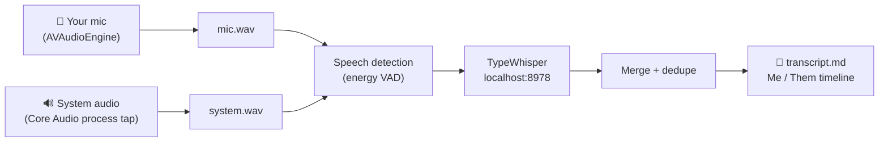

<p align="center">
  
</p>

<h1 align="center">MeetWhisper</h1>

<p align="center">
  <b>Fully-local meeting transcription for macOS — who said what, with your audio never leaving the Mac.</b>
</p>

<p align="center">
  
  
  
  
</p>

A menu bar app: hit **🎙️ Record** when your meeting starts, **Stop** when it ends,
and get an interleaved transcript that separates **you** (microphone) from
**everyone else** (system audio):

```
[00:04] Me:   Hey, can everyone see my screen?
[00:09] Them: Yes, looks good.
[00:15] Me:   Great, so the Q3 numbers...
```

No cloud, no accounts, no telemetry — recording, speech detection, and
transcription all happen on your machine.

<p align="center">
  
</p>

## Quick start

1. **Set up [TypeWhisper](https://www.typewhisper.com)** (the local speech engine
   MeetWhisper talks to): install it, open its **Settings and enable the API
   server toggle** (port 8978), and download a speech model.
2. **Install MeetWhisper**: grab the DMG from
   [Releases](https://github.com/ShahirShamim/MeetWhisper/releases) and drag the
   app to Applications — or build from source (below).
   > The app is not notarized. First launch: right-click → **Open**, or run
   > `xattr -dr com.apple.quarantine /Applications/MeetWhisper.app`
3. Click **🎙️** in the menu bar → **Record Meeting**, and grant the
   **Microphone** and **System Audio Recording** prompts.
4. **Stop** when done — the transcript lands in
   `~/Documents/MeetingTranscripts/` and is one click away in the menu.

## How it works



- **Two separate tracks.** Your mic is recorded with AVAudioEngine (raw capture —
  echo cancellation is off by default because macOS's voice-processing gate emits
  pure silence on an input-only engine; wear headphones for perfect separation).
  Meeting audio is captured with a Core Audio **process tap** (macOS 14.4+) — no
  virtual audio driver, no Screen Recording permission.
- **Local transcription.** On stop, each track is split into utterances by an
  energy-based VAD, and every chunk is sent to the
  [TypeWhisper](https://www.typewhisper.com) app's local HTTP API
  (`http://localhost:8978/v1/transcribe`). Chunk start offsets become timestamps;
  both tracks merge into one chronological transcript.
- **Bleed dedupe.** On speakers, the mic hears the meeting audio too, so the same
  words would appear as both "Them" and "Me". A transcript-level dedupe pass drops
  near-identical overlapping lines (keeping the system-track copy) and trims
  leaked word-runs out of mixed chunks.
- **Audio is never lost.** Both WAVs are written incrementally to
  `~/Documents/MeetingTranscripts/<timestamp>/`. If transcription fails (e.g.
  TypeWhisper isn't running), retry it any time from the session list.

## Requirements

- macOS 14.4+ (built/tested on macOS 26)
- [TypeWhisper](https://www.typewhisper.com) installed with its local API enabled
  (see below)
- Swift toolchain to build (Command Line Tools are enough — no Xcode needed)

### TypeWhisper setup (required)

MeetWhisper does no speech recognition itself — it sends audio to the TypeWhisper
app's local HTTP API. Before first use:

1. Install [TypeWhisper](https://www.typewhisper.com) and launch it.
2. In TypeWhisper's **Settings**, enable the **API server** toggle
   (default port 8978 — MeetWhisper expects `http://localhost:8978`).
3. Make sure a speech model is downloaded/selected in TypeWhisper (any engine
   works — Whisper, Parakeet, …).
4. Keep TypeWhisper running while transcribing. If it's not running, MeetWhisper
   saves the recording anyway and offers **Retry** once TypeWhisper is back up.

Everything stays on-device: the API is localhost-only and MeetWhisper makes no
other network requests.

## Install

### Option A — DMG (no build needed)

Download the DMG from [Releases](https://github.com/ShahirShamim/MeetWhisper/releases),
open it, and drag **MeetWhisper** to Applications. The build is not notarized, so
on first launch: right-click → **Open**, or run
`xattr -dr com.apple.quarantine /Applications/MeetWhisper.app`.

### Option B — build from source

```sh
./build.sh            # release build → build/MeetWhisper.app
open build/MeetWhisper.app
./make-dmg.sh         # optional: package build/MeetWhisper-<version>.dmg
```

First recording will prompt for **Microphone** and **System Audio Recording**
permissions. The bundle is ad-hoc signed, so a rebuild may re-prompt.

Note: the build scratch directory lives at `~/.cache/meet-to-text/build` because
SwiftPM's build database doesn't tolerate this volume's mount options.

## Settings

Menu bar → **Settings…** (or the app's Settings window):

- **Save recordings to** — output folder for all sessions (default
  `~/Documents/MeetingTranscripts`). The session list in the menu shows sessions
  from the currently selected folder.
- **Keep raw audio files** — when off, `mic.wav`/`system.wav` are deleted after a
  successful transcription (saves disk; retrying that transcription later becomes
  impossible). Default: on.
- **Folder name template** — naming convention for each session folder. Tokens:
  `{date} {time} {year} {month} {day} {hour} {minute} {second} {weekday}`.
  Default: `{date} {time}`. Name collisions get a ` 2`, ` 3`, … suffix.

## Headless pipeline test

Exercises VAD → TypeWhisper → transcript merge without the UI or recorders:

```sh
say -v Samantha -o /tmp/me.wav   --data-format=LEI16@16000 "Hello everyone. [[slnc 4000]] Let's look at the numbers."
say -v Daniel   -o /tmp/them.wav --data-format=LEI16@16000 "[[slnc 3000]] Yes, we can see it."
~/.cache/meet-to-text/build/release/MeetWhisper --test-pipeline /tmp/me.wav /tmp/them.wav
```

## Layout

```
Sources/MeetWhisper/
  MeetWhisperApp.swift        entry point (menu bar app + --test-pipeline mode)
  AppState.swift             UI state machine, session lifecycle
  Model/Session.swift        session folder + metadata (session.json)
  Audio/MicRecorder.swift    AVAudioEngine mic capture (raw; AEC unusable here)
  Audio/SystemAudioRecorder.swift  Core Audio process tap → aggregate device
  Audio/WavWriter.swift      any-format PCM → 16 kHz mono 16-bit WAV
  Pipeline/VADChunker.swift  energy VAD, utterance chunks with offsets
  Pipeline/TypeWhisperClient.swift  localhost:8978 /status + /transcribe
  Pipeline/TranscriptBuilder.swift  merged markdown transcript
  Pipeline/TranscriptionPipeline.swift  orchestration
  UI/MenuView.swift          menu bar window UI
```

## Notes & limitations

- Speaker separation is 2-way (Me / Them). Per-person labels inside the meeting
  audio would need a local diarization model — out of scope for now.
- Wearing headphones gives perfect separation. On speakers, meeting audio leaks
  into the mic track; the dedupe pass cleans the transcript, but the raw mic.wav
  still contains the bleed. Real echo cancellation was attempted and abandoned:
  AVAudioEngine voice processing either gates the mic to digital silence
  (input-only) or fails engine start with -10875 (any output render path) on
  macOS 26 / MacBook Air. A direct VPIO AudioUnit implementation is the known
  path if AEC becomes necessary.
- If the transcript only contains "Me" lines, check that System Audio Recording
  permission was granted (System Settings → Privacy & Security → Screen & System
  Audio Recording).
- If the transcript only contains "Them" lines, the mic track was silent — the
  app warns about this after recording. Usual cause: the microphone permission
  was reset by a rebuild (ad-hoc signature) and needs re-granting.
- Capture cannot be tested from a plain shell: a CLI-spawned process gets no
  mic/system-audio TCC grants and records digital silence without any error.
  Always test via the app bundle:
  `open -W -n build/MeetWhisper.app --args --test-record 8 raw /tmp/rec-test`
  (report written to `/tmp/rec-test/test-report.txt`).

## License

[MIT](LICENSE)
